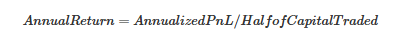
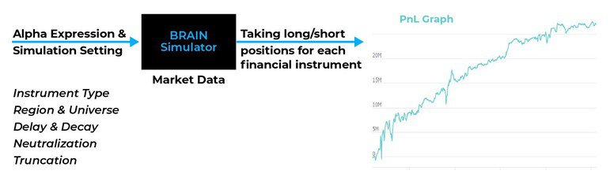
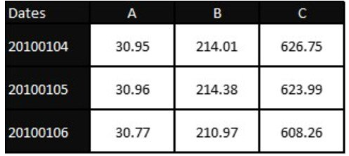
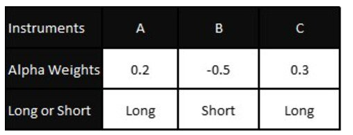
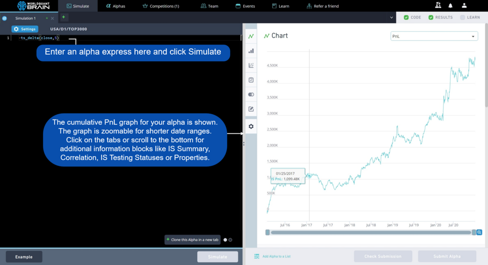
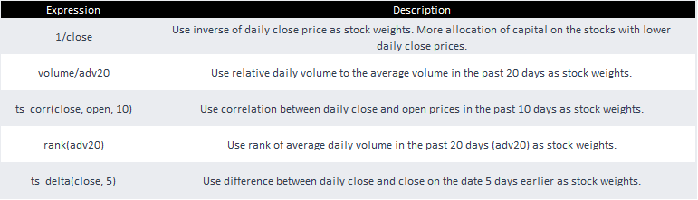
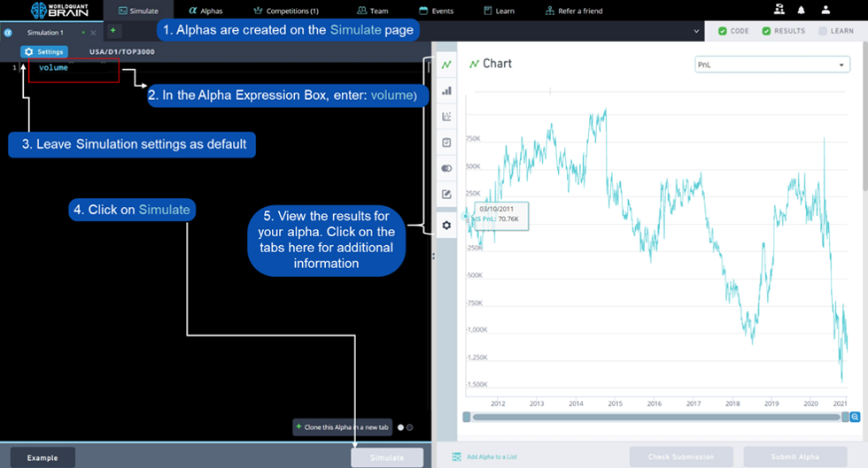
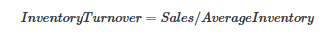
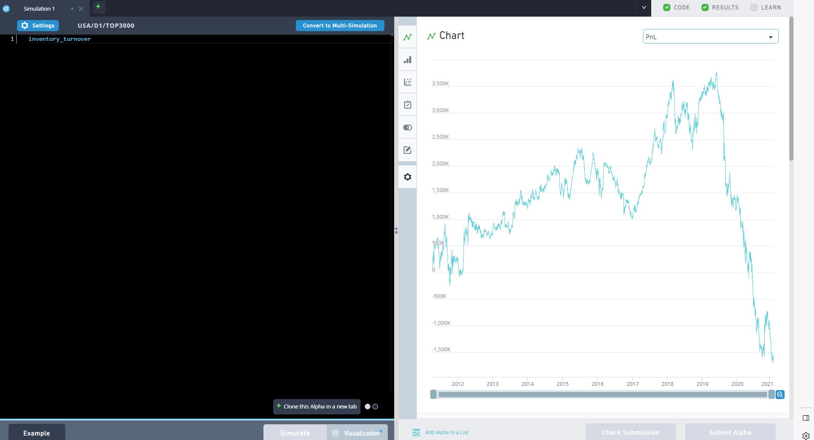

# 欢迎来到 WorldQuant BRAIN

> **归档信息**｜来源：BRAIN 平台 Learn 学习文档（用户原文粘贴，第 1 批）｜归档日期：2026-09-15
> 原文中的 9 张配图已落盘至 `images/`，按出现位置嵌入；末尾 9 条外部引用链接的抓取结果见 `refs/引用链接缓存.md`。
> 粘贴原文中存在整段重复（"金融基础知识 → 量化分析"两轮重复），本归档已合并为单份，正文文字未作改写。

---

本指南旨在提供 BRAIN 咨询顾问项目的基本概览，以及一些简单易懂的概念，帮助您开始制作 Alpha。这绝非详尽无遗的清单，但在完成本指南后，您将掌握足够的知识，可以尝试模拟各种思路。这是一个学习的过程，此前已有许多人走过这条路，无论您的背景如何，您也一定可以做到。祝您好运！

- 研究顾问——与 WorldQuant 合作的机会
- 金融基础知识——股票市场及其运作方式
- 量化分析——及其与 BRAIN 的关系
- 如何使用 BRAIN——快速表达式、算子和数据字段
- 常见金融分析方法示例——技术分析与基本面分析

---

## 研究顾问

### 与我们一起成为顾问

WorldQuant 是一家全球性的量化资产管理公司。由 Igor Tulchinsky 于 2007 年创立，我们在全球拥有超过 850 名员工，在全球市场中的各类资产类别上开发和部署投资策略。我们为全球人才提供机会，使其能够在特定获批国家担任研究顾问，并参与 WorldQuant 更广泛的研究工作。

### 全球社区

我们致力于通过自有的研究平台产出高质量的预测信号（Alpha），以实施专注于利用市场无效性的金融策略。我们的团队协作推动 Alpha 和金融策略的产出。WorldQuant BRAIN 通过其模拟平台（包含数据集和工具、业绩仪表盘以及增值度量指标），以互动的方式向用户介绍引人入胜的量化金融世界。

**550,000+ 用户 | 16,000+ 顾问 | 17 个地区**

### 成为顾问的好处

作为研究顾问，您将拥有以下机会：

- 获得基于贡献的财务报酬。每天最高可赚取 120 美元（基于活动），每季度最高可赚取 25,000 美元（基于业绩）
- 有机会被考虑获得符合条件的 BRAIN 顾问的实习和全职职位
- 成为全球精英量化社区的一员
- 能够在欧洲和亚洲的更多地区创建 Alpha
- 访问 85,000+ 个数据字段
- 访问特殊功能：数据可视化、进阶网络研讨会系列、多模拟、SuperAlpha、带 Python 的 BRAIN API 文档以及 Python 模拟。
- 还有很多。

### 谁有资格？

不需要特定的背景！科学、技术、工程、数学（STEM）或任何其他高度分析性和量化性相关领域的先前知识将会有所助益。

用户需要在 WorldQuant Challenge 中获得至少 10,000 分才有资格获得这一角色。目前，我们仅向以下地区的居民提供此机会：

- 亚美尼亚
- 中国大陆
- 中国香港
- 中国台湾
- 匈牙利
- 肯尼亚
- 韩国
- 印度尼西亚
- 印度
- 马来西亚
- 新加坡
- 英国
- 越南
- 泰国
- 美国
- 格鲁吉亚
- 尼日利亚

---

## 金融基础知识

我们的许多顾问都从非金融专业起步，所以如果您没有先前的金融知识，也不必担心。本节将为您补充一些基本信息。

### 股票市场如何运作

股票市场是指用于发行、购买和出售在证券交易所或场外市场交易的股票的公募市场。股票（又称股本）代表对公司的部分所有权，而股票市场是投资者买卖此类可投资资产所有权的地方 [1]。

#### 寻求回报

投资者通过以高于买入价的价格卖出股票来获利。例如，如果投资者以每股 10 美元的价格买入某公司股票，随后股价升至每股 15 美元，投资者便可以通过卖出股票实现 50% 的投资回报 [1]。WorldQuant 将回报定义为交易资本的回报率：



它表示该期间内的盈利或亏损金额，以百分比表示。

#### 做多某只股票

对股票采取多头（做多）头寸简单来说就是买入该股票，如果股价上涨，您就会获利。

#### 做空某只股票

另一方面，对股票采取空头（做空）头寸是指借入您并不拥有的股票（通常从您的经纪商处借入），然后将其卖出，并希望其价值下跌。当股价下跌时，您可以以低于卖出价的价格买回股票，并将借入的股票归还给您的经纪商。

#### 定义成交量

成交量是指某一资产或证券在一段时间内易手的数量，通常以一天为一个周期。例如，股票交易量可以指某一证券在其每日开盘与收盘之间交易的股份数量。交易量以及成交量随时间的变化，是技术交易者的重要输入 [2]。

#### 定义收盘价/开盘价

开盘价是指证券在交易日交易所开盘时首次成交的价格。收盘价是指交易时段结束前最后一笔交易的价格。这些价格很重要，因为它们用于创建传统的线形股票图表，也用于计算移动平均线和其他技术指标 [3, 4]。

**进一步阅读和参考资料：**

1. Corporate Finance Institute. (2022, October 28). Stock market. https://corporatefinanceinstitute.com/resources/wealth-management/stock-market/
2. What is volume of a stock, and why does it matter to investors? (2003, November 23). Investopedia. https://www.investopedia.com/terms/v/volume.asp
3. Close. (2003, November 18). Investopedia. https://www.investopedia.com/terms/c/close.asp
4. Opening price: Definition, example, trading strategies. (2005, July 3). Investopedia. https://www.investopedia.com/terms/o/openingprice.asp

---

## 量化分析

确定是做多（买入）某只股票还是做空它，有许多方法。金融中的量化分析（QA）是一种强调利用数学和统计分析来确定股票价值的方法。量化交易分析师（又称"quants"）使用各种数据——包括历史投资和股票市场数据——来开发交易算法和计算机模型。这些计算机模型生成的信息帮助投资者分析投资机会，并制定他们认为将会成功的交易策略 [5]。

### 关于 BRAIN

BRAIN 利用量化分析方法，是一个基于网络的全球金融市场模拟器，旨在探索 Alpha 研究。它接受 Alpha 表达式作为输入，并绘制其盈亏（PnL）曲线作为输出。



输入表达式会在历史日期的每一天针对每个金融工具进行评估，并据此构建投资组合。BRAIN 根据表达式的值投资于每个金融工具。它会建立头寸（买入或卖空），并为每个工具分配权重。

### 什么是 Alpha？

Alpha 是一种算法，它将输入数据（价量、新闻、基本面等）转换为一个向量，其中的值与我们希望在每个交易日于每个工具中持有的头寸和权重成比例。

### 权重

将市场数据想象成一个矩阵，每一行代表一个日期，每一列代表一只股票。例如，收盘价数据的矩阵可能如下所示：



表格：公司 A、B 和 C 在 3 个相应交易日的收盘股价。

Alpha 表达式的作用是将输入矩阵转换为一个权重输出向量，每个权重对应其中一只股票。Alpha 输出向量中，权重值对应于宇宙中的每个工具，可能如下所示：



表格：输出向量，用于指示公司 A、B 和 C 的交易方向及仓位大小。

### 累积盈亏（PnL）

一旦我们从 Alpha 表达式中得到股票的权重，下一步就是计算每一天的盈亏（PnL）。

根据上表，我有 weight_A = 0.2、weight_B = -0.5 和 weight_C = 0.3。现在我可用于投资的资金量称为"账面规模"。假设我的账面规模为 100 美元。因此我计算我想投资于每只股票的资金：

- money_A = 0.2 \* 100 美元 = 多头 20 美元
- money_B = -0.5 \* 100 美元 = 空头 50 美元
- money_C = 0.3 \* 100 美元 = 多头 30 美元

现在，我买入价值 20 美元的 A，卖出价值 50 美元的 B，买入价值 30 美元的 C。现在我拥有一个总价值为 100 美元的投资组合。

我在模拟期内持有该投资组合整整一天，并于次日卖出。在这一天中，股票 A、B、C 的价格发生了变化。因此我的投资组合总价值也发生了变化，例如从 100 美元变为 105 美元。所以我当天获得了 5 美元的利润。

现在我再次计算股票的 Alpha 值，再次计算权重，并再次交易价值 100 美元的投资组合。**[注意：在 BRAIN 中，无论您的投资组合是盈利还是亏损，我们每天都使用恒定的账面规模。]**

这一过程在模拟期内每天重复，以计算并绘制累计 PnL。



### 降低风险与波动

一个优秀的 Alpha 理想情况下应具有持续增长的 PnL、较高的年化回报，更重要的是，累积利润曲线波动较小。如果标准差较低，曲线波动通常较小。如果曲线表现出高波动率，即使回报很高，该 Alpha 也不被视为足够优秀。

WorldQuant 致力于开发具有低波动率和低风险的市场中性股票多空 Alpha。此类投资颇具吸引力，因为它们预期能产生比纯多头投资组合明显更好的风险调整后回报。股票多空市场中性策略为对冲基金常用，其目标是尽量减少对市场的敞口，并从两只股票之间价差的变化中获利。

**进一步阅读和参考资料：**

5. What to know about quantitative analysis. (2014, April 11). Investopedia. https://www.investopedia.com/articles/investing/041114/simple-overview-quantitative-analysis.asp

---

## 如何使用 BRAIN 平台

理论已经讲得够多了，让我们深入探讨如何在 BRAIN 上编写您的第一个 Alpha。

### 无需编程经验

对于所有非程序员来说，使用 BRAIN 的好消息是不需要任何先前的编程经验。

### BRAIN 的编码方式

BRAIN 使用快速表达式语言，它由两个主要元素组成：数据字段和算子。

### 我可以在 Alpha 中使用 Python / R / MATLAB 等吗？

我们的一位用户曾问我们：是否计划允许用户使用 Python/MATLAB/R 与 BRAIN API 交互、分析数据集并提交 Alpha 向量？

我们的答复是：BRAIN 目前支持使用快速表达式和 Python。关于 API，当 API 通信以低强度进行时，我们目前不禁止对 BRAIN 的程序化访问。

### 数据字段、数据集

数据字段是指有名称的数据集合，例如"开盘价"或"收盘价"。

数据集是数据字段的集合。例如，"开盘价"和"收盘价"可以在此处（这里）的价量数据集中找到。大多数用户通常从价量和基本面数据集入手。

### 算子

算子是实现您的 Alpha 思路所需的一组数学或统计技术，例如数学算子：+ - / \*，或章节算子（如"rank"）。请阅读 学习/算子 以了解更多详情。

以下是一些使用数据字段和算子构建 Alpha 的常见示例：



| Expression | Description |
|---|---|
| `1/close` | Use inverse of daily close price as stock weights. More allocation of capital on the stocks with lower daily close prices. |
| `volume/adv20` | Use relative daily volume to the average volume in the past 20 days as stock weights. |
| `ts_corr(close, open, 10)` | Use correlation between daily close and open prices in the past 10 days as stock weights. |
| `rank(adv20)` | Use rank of average daily volume in the past 20 days (adv20) as stock weights. |
| `ts_delta(close, 5)` | Use difference between daily close and close on the date 5 days earlier as stock weights. |

您可以通过点击模拟器页面上的"示例"按钮（左下角）来尝试一些示例 Alpha。善用提示并测试几个模拟吧！点击此处立即尝试：模拟页面

---

## 股票市场的分析方法

您可能会问我们，如何为新 Alpha 想出思路？本节将带您了解两个分别利用技术分析和基本面的 Alpha 思路，并解释其背后的思考过程。

### 技术分析

技术分析是一种交易纪律，通过分析从交易活动中收集的统计趋势（例如价格走势和成交量）来评估投资并识别交易机会。技术分析师认为，证券过往的交易活动和价格变化可以成为其未来价格走势的有价值指标。

在行业范围内，研究人员已经开发出数百种模式与信号来支持技术分析交易。其中包括趋势线、通道、移动平均线以及动量指标 [6]。

#### 以成交量作为指标

如果一家公司的股票成交量很高，说明有很多人在买卖该股票。假设我们的假设是，成交量更高的公司比成交量低的公司更受欢迎。那么我们将把更多权重分配给成交量更高的公司。

表达这一思路的一种方式是这样的 Alpha 表达式：

```
volume
```



### 基本面分析

基本面分析是一种通过考察相关的经济和金融因素来衡量证券内在价值的方法。基本面分析师研究任何可能影响证券价值的因素，从经济状况和行业状况等宏观经济因素，到公司管理层有效性等微观经济因素。

分析师可以将公司的增长率与其所在的行业和部门进行比较，并结合所提供的其他信息，以判断该公司是否被正确定价 [7]。

#### 存货周转率

财务比率是基本面数据的比率，能提供有关公司健康状况和投资决策的洞察。一个常见的财务比率是存货周转率。它是一种活动比率，衡量公司销售和补充其存货的速度。其计算公式为：



销售额除以平均存货。

我们的假设是，存货周转率较高的股票会有更好的业绩，因此应被分配更多权重。

Alpha 表达式如下：

```
inventory_turnover
```



### Simulation Settings

| Region | Universe | Language | Decay | Delay | Truncation | Neutralization | Pasteurization | NaN Handling | Unit Handling | Max Trade | Max Position |
|---|---|---|---|---|---|---|---|---|---|---|---|
| USA | TOP3000 | Fast Expression | 0 | 1 | 0.08 | Market | On | Off | Verify | OFF | |

### 时间序列与横截面

此外，还有两个常用的算子类别：时间序列和横截面。

时间序列分析有助于观察某个变量随时间的变化情况。假设您想分析某只股票在一年内每日收盘价的时间序列。您可以获取该股票过去一年中每个交易日的所有收盘价列表，并使用技术分析工具分析这些时间序列数据，以了解该股票的时间序列是否呈现任何季节性。这将帮助您判断该股票是否在每年固定的时间出现高峰和低谷 [8]。

或者，您也可以使用横截面分析，将特定公司与同行业同类公司进行比较。横截面分析可以聚焦于单家公司，与其最大的竞争对手进行逐一比较，也可以从行业整体视角出发，识别具有特定优势的公司。本质上，横截面分析向投资者展示，在您所关注的核心指标下，哪家公司是最优的选择 [9]。

---

我们希望您喜欢这份指南！要开始使用，您可以点击模拟页面上的"示例"按钮（左下角）。那里会有一些示例 Alpha 以及改进提示供您参考。

如果您有任何与研究相关的问题，您可以查看我们的社区论坛并在那里发布您的问题。

**进一步阅读和参考资料：**

6. Technical analysis: What it is and how to use it in investing. (2003, November 24). Investopedia. https://www.investopedia.com/terms/t/technicalanalysis.asp
7. Fundamental analysis: Principles, types, and how to use it. (2003, November 23). Investopedia. https://www.investopedia.com/terms/f/fundamentalanalysis.asp
8. Time series definition. (2006, March 12). Investopedia. https://www.investopedia.com/terms/t/timeseries.asp
9. What is cross sectional analysis and how does it work? (2007, May 21). Investopedia. https://www.investopedia.com/terms/c/cross_sectional_analysis.asp
