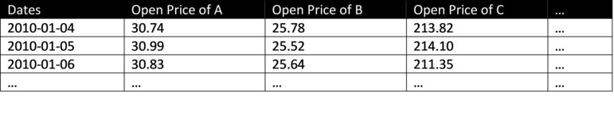
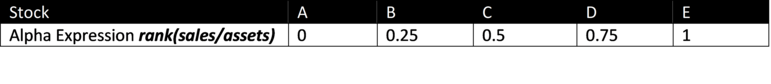
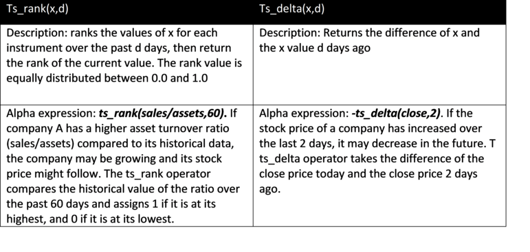
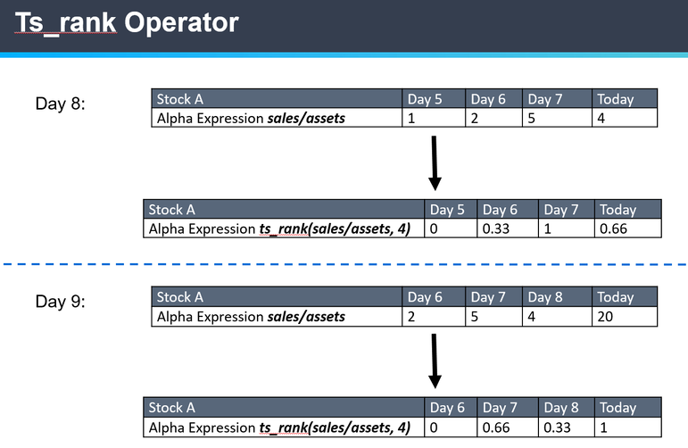
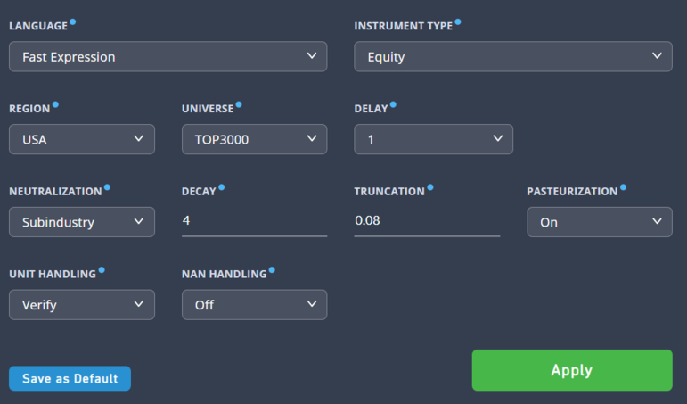

# Intermediate Pack - Improve your Alpha [2/2]

> **归档信息**
> - 页面：<https://platform.worldquantbrain.com/learn/documentation/intermediate-pack-part-2>
> - 页面 id：`intermediate-pack-part-2` ｜ 课程：`Getting Started` ｜ 预计时长：PT5M
> - 平台最后更新：2026-08-23T02:12:52.780622-04:00
> - 来源：**平台官方 tutorial-pages 接口原文**（`GET /tutorial-pages/{id}`），文字/表格/图片均为原样转换，未改写
> - 抓取：`src/tools/fetch_learn_docs.py`｜抓取日期 2026-09-15

---

## Use Different Operators

Remember the cross-sectional operators and time-series operators from the Starter pack? You can use them here. Secondly, you can try out different data fields. We recommend exploring the price volume dataset, model dataset and fundamental dataset. Lastly, you can tinker with different simulation settings. These tips should help improve the performance of your second Alpha.

**Divide (/)**

We can divide data fields with other data fields.

Imagine market data being a matrix, with each row representing one date and each column representing one stock. For example, the matrix for close price data of stocks in universe US TOP3000 would look like this:

And the matrix for open data of above stocks would look like this:

Say you enter an Alpha expression like ***close/open*** in the Simulate page found in the Alphas dropdown tab. When you click Simulate, BRAIN will evaluate the Alpha expression against the matrix of market data for each date and each stock.

**Rank(x)**

Description: the Rank operator ranks the value of the input data x for the given stock among all instruments, and returns float numbers equally distributed between 0.0 and 1.0

Alpha expression: ***rank(sales/assets)***. If company B has a higher asset turnover ratio (sales/assets) than company A, stock B may outperform stock A. The rank operator helps to limit the extreme values of that ratio.

For example:

The numbers imply that if you have $126, you must use $100 to go long stock E (~80% of your total capital). So, your strategy would depend crucially on how the last stock performs. But, isn’t that too risky? Applying the rank function to the alpha expression ***rank(sales/assets)***, you get:

This time you see that the stock with the largest weight occupies only 40% of your portfolio.

**Ts_rank & Ts_delta Operator**

Visual Illustration of Ts_rank Operator:

## Change Simulation Settings

In your first Alpha simulation, you left the simulation settings on default. Changing certain simulation settings may help you improve your Alpha results. We will go through Region, Universe, Neutralization, Decay and Truncation. The other settings will be covered in a later guide.

**Region**

Region refers to the market in which the Alpha will simulate trades, for example, the U.S. equity market or Chinese equity market.

**Universe**

Universe is a set of trading instruments ranked by their liquidity. For example, “US: TOP3000” represents the top 3,000 most liquid stocks in the U.S. market.

**Decay**

Decay is used for averaging the Alpha signal within a specified time window. The settings perform linear decay on the Alpha. Tip: Decay can be used to reduce turnover, but decay values that are too large will attenuate the signal.

**Truncation**

Truncation sets the maximum weight for each stock in the overall portfolio. It aims to guard against excessive exposure to movements in individual stocks. The recommended setting is between 0.05 and 0.1 (entailing 5-10%).

**Neutralization**

Market risks and industry specific risks are prevalent risks within equities. However, these risks can be reduced by creating long-short neutral portfolios using a concept called neutralization. After neutralizing the portfolios to market or industry specific groups, no net position is taken with respect to that group, i.e. allotting the same amount of dollars in long (buying) and short (selling) positions. That way, you are less exposed to risk, whether the entire market goes up or down.

When Neutralization = “Market/Industry/Sub-industry” it does the following operation: *Alpha = Alpha – mean(Alpha)* where Alpha is the vector of weights.

If the hypothetical book size is 20 million, we would end up investing $10 million in long positions and $10 million in short positions. Thus, no net position is taken with respect to the market. In other words, the long exposure cancels out the short exposure completely, making this hypothetical strategy market neutral.

The three different neutralization methods determine which groups are used for neutralizing Alpha values. The correct choice of neutralization depends on the logic or formula used by the Alpha. The results should indicate which neutralization will be most effective.
