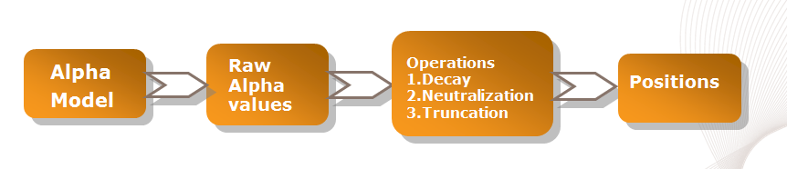

# BRAIN and Alphas

> **归档信息**
> - 页面：<https://platform.worldquantbrain.com/learn/documentation/brain-and-alphas>
> - 页面 id：`brain-and-alphas` ｜ 课程：`Getting Started` ｜ 预计时长：-
> - 平台最后更新：2026-08-26T07:09:00.682196-04:00
> - 来源：**平台官方 tutorial-pages 接口原文**（`GET /tutorial-pages/{id}`），文字/表格/图片均为原样转换，未改写
> - 抓取：`src/tools/fetch_learn_docs.py`｜抓取日期 2026-09-15

---

## What is the difference between crossover and mixing signals?

Answer: If there are different components of an [Alpha](https://support.worldquantbrain.com/hc/en-us/articles/4902349883927-Click-here-for-a-list-of-terms-and-their-definitions#:~:text=A-,Alpha,-An) say, and when used in combination, the positions taken by one part is reduced/changed due to the inverse positions taken by another part, it would be cross-over. Mixing would be if you combine two completely different ideas just to improve the performance. But we recommend not doing it at Alpha level. Mixing might also lead to cross-over.

## I tried to code the Alpha based on the paper or books recommended by WorldQuant, but they performed much poorer than my improvised one. How can I improve from the academic results?

Answer: Academic results are just to be used as a guiding light or a place to start your Alpha research. Exact implementation of the model mentioned in the paper may not be efficient because of many reasons. Implement the idea in the papers in their most elementary form and then improve them by filtering or weighing based on factors, better implementation of the model etc.

## Does BRAIN platform work with every browser?

Answer: Officially supported desktop browsers:

- Internet Explorer 9 and above

- Firefox 3.6 and above

- Chrome

Safari 5.1 and above, and most versions of Opera, while not officially supported, may work fairly well. All desktop OSs that can run a supported browser are supported. There is partial support for mobile devices including Android and iOS (no guarantees here). If it doesn’t work on a particular browser, please report it to [support@worldquantbrain.com](mailto:support@worldquantbrain.com).

## How do you get each stock position from expression result?

Answer: Below figure shows the sequence of operations/ transformations that are applied on an Alpha:

## I am wondering if it is possible to abort a running simulation?

Answer: We have a cancel [simulation](https://support.worldquantbrain.com/hc/en-us/articles/4902349883927-Click-here-for-a-list-of-terms-and-their-definitions#:~:text=definition.-,Simulation,-Simulation) button that appears after simulating an Alpha.

## Where is my profile? How can I change my password?

Answer: You can view your profile at [My Account](https://platform.worldquantbrain.com/profile/account/basic-details) and change your password at [Change Password](https://platform.worldquantbrain.com/profile/account/change-password).

## Even after searching a lot, I am unable to find out more information about stock weights. Can you please provide more information about the same?

Answer: Alpha value for a stock represents the [weight](https://support.worldquantbrain.com/hc/en-us/articles/4902349883927-Click-here-for-a-list-of-terms-and-their-definitions#:~:text=W-,Weight,-BRAIN) of that particular stock in the complete portfolio. This is how it works:

1) You use an Alpha expression to assign Alpha values for each stock in the [universe](https://support.worldquantbrain.com/hc/en-us/articles/4902349883927-Click-here-for-a-list-of-terms-and-their-definitions#:~:text=U-,Universe,-Universe).
2) Operations like [neutralization](https://support.worldquantbrain.com/hc/en-us/articles/4902349883927-Click-here-for-a-list-of-terms-and-their-definitions#:~:text=strategy.-,Neutralization,-Neutralization), [decay](https://support.worldquantbrain.com/hc/en-us/articles/4902349883927-Click-here-for-a-list-of-terms-and-their-definitions#:~:text=Factor.-,Decay,-Sets) are then applied on these Alpha values as specified by the user.
3) These new Alpha values assigned to each stock are then converted to the amount of money allocated to a stock by scaling it to [booksize](https://support.worldquantbrain.com/hc/en-us/articles/4902349883927-Click-here-for-a-list-of-terms-and-their-definitions#:~:text=details.-,Booksize,-Booksize).

This stock weight is thus nothing but the weight of the stock in the overall portfolio.

Let me give you a simple example, when Alpha = close.
Suppose you have a universe, with just 5 stocks (A, B, C, D,E) and on a particular date (20100104) they have the following close prices (in USD):

[Instruments](https://support.worldquantbrain.com/hc/en-us/articles/4902349883927-Click-here-for-a-list-of-terms-and-their-definitions#:~:text=details.-,Instrument,-Instrument): A B C D E

close: 6 5 2 8 4

Now, you want to use the value of these close prices to calculate Alpha weights on the next trading day. You first start with the Alpha expression, which is Alpha = close. So you first make a vector of "close". i.e. (6, 5, 2, 8, 4). [Note: If your expression were Alpha = 1 / close, you'd have made a vector of "1 / close", i.e. (1/6, 1/5, 1/2, 1/8, 1/4) = (0.167, 0.2, 0.5, 0.125, 0.25). ]

Now you have the vector (6, 5, 2, 8, 4), this is not a vector of weights. A vector of weights needs to be normalized to 1. So we divide each element by the sum (= 25), so the sum of the elements equals 1.
So the new vector is: (6 / 25, 5 / 25, 2 / 25, 8 / 25, 4 / 25) = (0.24, 0.20, 0.08, 0.32, 0.16). The sum of this vector is 1. And this is our portfolio. We multiply this by the [booksize](https://support.worldquantbrain.com/hc/en-us/articles/4902349883927-Click-here-for-a-list-of-terms-and-their-definitions#:~:text=details.-,Booksize,-Booksize) (20 Million), and we get the amount of money we want to bet on each of the stocks.

This was the case when we have set [Neutralization](https://support.worldquantbrain.com/hc/en-us/articles/4902349883927-Click-here-for-a-list-of-terms-and-their-definitions#:~:text=strategy.-,Neutralization,-Neutralization) = "None". But this makes our [strategy](https://support.worldquantbrain.com/hc/en-us/articles/4902349883927-Click-here-for-a-list-of-terms-and-their-definitions#:~:text=performance.-,Strategy,-Investment) ride on market-risk. So, we select Neutralization = "Market". In this case again, we start out by creating a vector of "close" = (6, 5, 2, 8, 4).
Now we make it "mean-neutral", i.e subtract the mean (= 5) from each of the elements, making the sum of the vector = 0.
So the mean-neutral vector is: (1, 0, -3, 3, -1). You can see the sum of the elements is zero.

Now, in order to normalize, we need to ignore the sign and make the sum of elements = 1. So we calculate the sum of absolute values (= 1 + 0 + 3 + 3 + 1 = 8). Now we divide each element by this sum, giving us (1 / 8, 0 / 8, -3 / 8, 3 / 8, -1 / 8) = (+0.125, 0, -0.375, +0.375, -0.125).
Now this is a normalized mean-neutral vector of weights. We multiply this by the booksize of 20 Million USD to get the amount we want to invest on each of the stocks, where a positive sign indicates taking long position and negative sign indicates taking short position. Also, since the positive values add up to +0.5 and the negative values add up to -0.5, we end up investing 10 Million in long and 10 Million in short positions, making the [strategy](https://support.worldquantbrain.com/hc/en-us/articles/4902349883927-Click-here-for-a-list-of-terms-and-their-definitions#:~:text=performance.-,Strategy,-Investment) dollar neutral as required.

## Once we have got the weights of the stocks from the Alpha expression after normalization and all , what is the next step? How do we get the days profit and loss just by the weights assigned by the Alpha expression?

Answer: Suppose you have 3 stocks in your universe - A, B, C.

And for a particular day you have the normalized weights for each of these stocks. Say, weight_A = 0.2, weight_B = 0.3 and weight_C = 0.5.
Now the amount of money I have got to invest is called the "booksize". Suppose my booksize is 100 USD. So I calculate the money I want to invest in each of the stocks:

money_A = 0.2 * 100 USD = 20 USD
money_B = 0.3 * 100 USD = 30 USD
money_C = 0.5 * 100 USD = 50 USD

Now, I buy 20 USD worth of stock A, 30 USD worth of stock B and 50 USD worth of stock C. Now I have a portfolio, which is worth a total of 100 USD.
I keep this portfolio for one full day, and sell it the next day in the simulation period. Now in one day, the prices of stocks A, B and C have changed. So the total value of my portfolio has also changed, say from 100 USD to 105 USD. So, I have made a profit of 5 USD on that day.
Now I again calculate the Alpha values for the stocks, and again calculate weights, and again buy 100 USD worth of portfolio. [Note: In BRAIN platform, we use constant booksize for all the days, regardless of whether your portfolio makes money or loses money.]
The booksize used by BRAIN platform is 20 Million USD for the US based stocks.

This is repeated for each day in the simulation period to calculate and plot the cumulative [PnL](https://support.worldquantbrain.com/hc/en-us/articles/4902349883927-Click-here-for-a-list-of-terms-and-their-definitions#:~:text=consultants-,Profit%20and%20Loss%20(PnL),-Profit).

## Aren’t we supposed to focus on short term trading? Why is the time interval of several years? Is that just for demonstration purposes?

Answer: Such time frames are for simulation purposes and it helps us conceptualize what would have happened if this Alpha was put into a [strategy](https://support.worldquantbrain.com/hc/en-us/articles/4902349883927-Click-here-for-a-list-of-terms-and-their-definitions#:~:text=performance.-,Strategy,-Investment) during that time period with daily activity, for daily frequency trading.

## Could you please explain statistical arbitrage?

Answer: It is like betting on the law of large numbers. Assuming you win 51% of the number of times you bet which stock will perform better, you will make money on average, thereby exploiting the arbitrage in a statistical way.

## I use R and MATLAB for simulations. Is there any way in which I can use R or MATALB for Alphas?

Answer: Good question but BRAIN platform is available for use only with direct Expressions.

## How would we know what the weights that are being given to each stock everyday are and how the weights are changing every day?

Answer: You won't have visibility into specific equities as an Alpha is designed to create overall strategy that can be applied in a weighted fashion across the portfolio.

## Is BRAIN platform doing high-frequency trade? And is it doing intraday trade?

Answer: Our Alpha is daily rebalanced and daily simulated instead. Strictly speaking, we are mainly doing daily rebalance middle frequency Alpha research. “Low” or “High” frequency depends on the audience. To mutual fund, weekly rebalance is “high”. For the real high frequency trading firms, daily rebalance is “low”. We are definitely not the common referred “HFT” whose advantage is mainly on execution speed.

## Would it be possible to provide an API so that I can use OAuth or something similar to send an Alpha to the server, and get a json style response on how well it performed, so that I could then parse it and adjust my algorithm automatically?

Answer: I am afraid BRAIN platform cannot support API to send an Alpha to server. Your suggestion is appreciated. We will forward to develop team for further discussion.

## How can we use pairs trading in BRAIN platform?

Answer: We are currently not supporting pairs trading in BRAIN platform. Instead, I recommend you should consider all stocks as an universe (e.g. TOP 3000) rather than a little set of stocks in pair trading. In BRAIN platform, an 'Alpha' refers to a mathematical model or strategy, written as an expression, which places different bets (weights) on different [instruments](https://support.worldquantbrain.com/hc/en-us/articles/4902349883927-Click-here-for-a-list-of-terms-and-their-definitions#:~:text=details.-,Instrument,-Instrument) (stocks), and is expected to be profitable in the long run. In simple terms, it creates a vector of weights, with each weight corresponding to one of the stocks in the selected universe. These weights may or may not be market neutralized, as per your neutralization setting (market, [industry](https://support.worldquantbrain.com/hc/en-us/articles/4902349883927-Click-here-for-a-list-of-terms-and-their-definitions#:~:text=I-,Industry,-An), [sub-industry](https://support.worldquantbrain.com/hc/en-us/articles/4902349883927-Click-here-for-a-list-of-terms-and-their-definitions#:~:text=SuperAlphas.%C2%A0-,Subindustry,-Sub) or none). This creates a portfolio for each day in the simulation period, which can then be used to calculate that day's PnL.

For example, if your expression is '1 / close', then for each day in the simulation period, BRAIN platform calculates the value '1 / closePrice' for each stock using the yesterday's closing price for each stock. These values (one for each stock) are normalized, so that they all sum up to 1. This gives us weight for each stock in our universe and this vector of weights is called a portfolio for that day. We can then place money on each stock in proportion to its weight in the portfolio and calculate the profit or loss made by the portfolio on that day. This is then repeated for all the days in the simulation period.

## What's the actual definition of signal? How much Sharpe increasing could be reached when improving the signal?

Answer: [Signal](https://support.worldquantbrain.com/hc/en-us/articles/4902349883927-Click-here-for-a-list-of-terms-and-their-definitions#:~:text=results.-,Signal,-Any) is a loosely defined term and so does not have any rigorous definition as such. In our talk we call any elementary model which on [backtest](https://support.worldquantbrain.com/hc/en-us/articles/4902349883927-Click-here-for-a-list-of-terms-and-their-definitions#:~:text=operators.-,Backtesting,-Backtesting) shows a glimmer of a possible Alpha as signal. Filtering, weighing with different factors, improving the basic expressions of the signal etc. can help you achieve good performance improvement over the signal.
