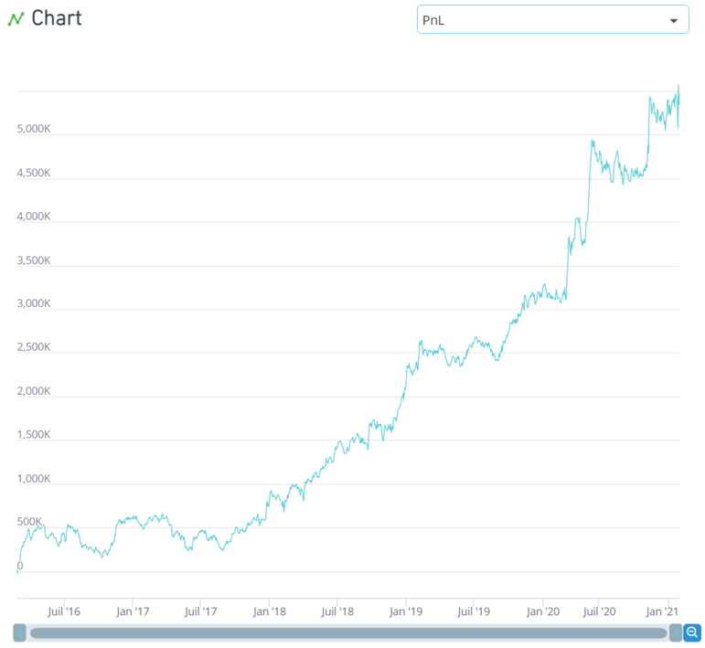
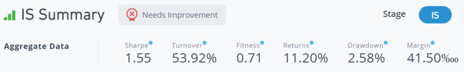
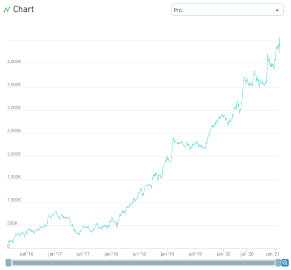
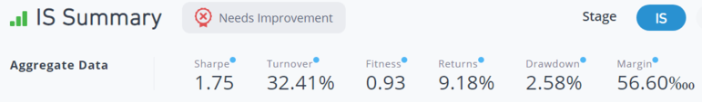
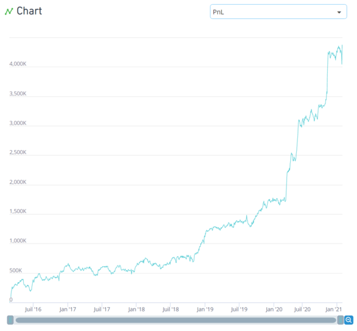
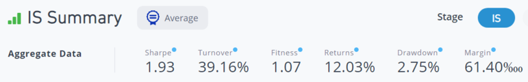

# Intermediate Pack - Conditional Operators [3/3] 🥉

> **归档信息**
> - 页面：<https://platform.worldquantbrain.com/learn/documentation/intermediate-pack-part-3>
> - 页面 id：`intermediate-pack-part-3` ｜ 课程：`Getting Started` ｜ 预计时长：-
> - 平台最后更新：2026-08-26T07:10:28.166238-04:00
> - 来源：**平台官方 tutorial-pages 接口原文**（`GET /tutorial-pages/{id}`），文字/表格/图片均为原样转换，未改写
> - 抓取：`src/tools/fetch_learn_docs.py`｜抓取日期 2026-09-15

---


## Conditional Operators

TradeWhen Operator

***Syntax: trade_when(Event_condition, Alpha_expression, -1)***

The trade_when operator has several uses: it is used in order to change Alpha values under a specified condition, close Alpha positions simulated under a specified condition and to hold Alpha values in other cases. It is instrumental in reducing turnover.

The operator takes as input, the event condition and the Alpha expression. If exit condition is true, the Alpha is equal to NaN (does not trade). If exit condition is false and event condition is true, Alpha = Alpha expression. Finally, if exit condition is false and event condition is false, the Alpha is equal to the previous day’s Alpha, thus the same positions are held.

Example:

***rank(trade_when(volume>adv20,-returns,-1))***. Suppose we believe that stocks that give high returns today could give low returns tomorrow (this concept is known as “reversion”). We note that reversion is typically observed more profoundly in stocks showing high volume trading activity or high 'volatility' in stock returns. Thus, we should implement the Alpha expression based on only when the number of stocks traded today is higher than the monthly average by using trade_when(volume>adv20).

If-else Operator

Another conditional operator is the if_else operator. The syntax is as follows: ***if_else(Event_condition, Alpha_expression_1, Alpha_expression_2)***


## Detailed Walkthrough of Creating an Alpha

The first and foremost step of building an Alpha is coming up with an Alpha idea. In the beginning, the Learn section of the platform is a good resource for sourcing ideas. For instance, the “Example” tab and Alpha concepts page are very useful. Here are some general guidelines to build Alphas:

**Know your Operators**: The second step of the research process is to implement your Alpha idea using operators. Hence, it is important to understand the concept of operators well. We recommend you go through the detailed operator descriptions before reading the research papers.

**Formulating your alpha**: The final step is to formulate your Alpha. This is where your understanding of the operators comes in. Try to replicate the idea suggested in the paper and assess its performance, then think of any improvements that can be made on this version using any additional operators / data.

We will take you through an example to show you how you can come up with an idea and refine it to create an Alpha.

**Iteration 1**

In this example we are using the ***if_else*** conditional operator, ***ts_delta(close,2)*** (difference of close price today and 2 days ago), ***volume*** (volume today) and ***adv20*** (average daily volume in past 20 days) datafields.

Our Hypothesis is: If the stock price of a company has increased over the last 2 days, it may decrease in the future. Also, if the number of stocks bought and sold today is higher than the monthly average, then the reversion effect may be observed more profoundly.

Implementation: We will take positions according to the difference of close price today and 3 days ago with alpha_2 using the ts_delta operator. When current volume is higher than average daily volume, we will take a larger position by multiplying by 2 to get alpha_1. Simulation settings are left as default.


**示例 Alpha 表达式**

```
event=volume>adv20;
alpha_1=2*(-ts_delta(close,3));
alpha_2=(-ts_delta(close,3));
If_else(event,alpha_1,alpha_2)
```

| 设置项 | 值 |
|---|---|
| 标的类型（`instrumentType`） | `EQUITY` |
| 地区（`region`） | `USA` |
| 股票池（`universe`） | `TOP3000` |
| Delay（`delay`） | `1` |
| Decay（`decay`） | `3` |
| 中性化（`neutralization`） | `SUBINDUSTRY` |
| Truncation（`truncation`） | `0.01` |
| Pasteurization（`pasteurization`） | `ON` |
| Unit Handling（`unitHandling`） | `VERIFY` |
| NaN Handling（`nanHandling`） | `OFF` |
| 语言（`language`） | `FASTEXPR` |
| Max Trade（`maxTrade`） | `OFF` |







The Alpha can’t be submitted but the results aren’t too bad either. This is a good sign for us and increases our confidence in the idea since our first implementation has shown decent results. Performance metrics give us a direction that we need to focus on increasing the fitness.

**Iteration 2**

In our first iteration, we used the if_else operator, what if we used the trade_when operator? We can try another implementation of our idea by entering our positions when current volume is higher than average daily volume, and maintain this position for the remainder of the quarter.


**示例 Alpha 表达式**

```
event=volume>adv20;
alpha=(-ts_delta(close,3));
trade_when(event,alpha,-1)
```

| 设置项 | 值 |
|---|---|
| 标的类型（`instrumentType`） | `EQUITY` |
| 地区（`region`） | `USA` |
| 股票池（`universe`） | `TOP3000` |
| Delay（`delay`） | `1` |
| Decay（`decay`） | `4` |
| 中性化（`neutralization`） | `SUBINDUSTRY` |
| Truncation（`truncation`） | `0.01` |
| Pasteurization（`pasteurization`） | `ON` |
| Unit Handling（`unitHandling`） | `VERIFY` |
| NaN Handling（`nanHandling`） | `OFF` |
| 语言（`language`） | `FASTEXPR` |
| Max Trade（`maxTrade`） | `OFF` |







Our turnover has decreased since we moved from if_else to trade_when operator and take positions in all the stocks. Our fitness has increased, going from 0.71 to 0.93. However, the fitness is still below 1 and remains un-submittable. Let’s see how else we can improve this idea.

**Iteration 3**

For iteration 3, we will use the same Alpha expression as Iteration 2 and adjust the simulation settings.

We will change decay to 2, neutralization to Industry and truncation to 0.01.


**示例 Alpha 表达式**

```
event=volume>adv20;
alpha=(-ts_delta(close,3));
trade_when(event,alpha,-1)
```

| 设置项 | 值 |
|---|---|
| 标的类型（`instrumentType`） | `EQUITY` |
| 地区（`region`） | `USA` |
| 股票池（`universe`） | `TOP3000` |
| Delay（`delay`） | `1` |
| Decay（`decay`） | `2` |
| 中性化（`neutralization`） | `INDUSTRY` |
| Truncation（`truncation`） | `0.01` |
| Pasteurization（`pasteurization`） | `ON` |
| Unit Handling（`unitHandling`） | `VERIFY` |
| NaN Handling（`nanHandling`） | `OFF` |
| 语言（`language`） | `FASTEXPR` |
| Max Trade（`maxTrade`） | `OFF` |


Here is the result:







We see a significant improvement in most of our performance metrics. Sharpe has increased from 1.75 to 1.93, fitness has improved from 0.93 to 1.07, but turnover has increased. Thus, we see from this iteration that this mean reversion strategy works better when it is industry neutralized, decay is lowered and truncation is reduced.

**Summary:**

You can use different implementations for the same idea on the BRAIN platform or use any of the numerous data fields at your disposal to improve an idea. Implementing new ideas will help you build higher Sharpe Alphas. After reading this Intermediate pack, you now have an array of operators and datafields at your disposal, let’s get simulating!

**Some Additional Tips**

- This [paper](https://arxiv.org/ftp/arxiv/papers/1601/1601.00991.pdf) lists 101 Alpha expressions. Although most are not submittable, they provide a good starting point. See if you can improve some of the simpler expressions, or explain them in words
- Reading helps. Research papers are helpful in guiding you to think in a certain direction, which you might otherwise miss completely. Before reading, also make sure that the dataset given in the research paper exists in BRAIN. This will save you a lot of time in case you read a research paper only to realize the dataset isn’t available.
- Do not spend an extraordinary amount of time improving a single idea either. Move on to another datafield or operator. Try to understand more about how each operator functions and the characteristics of each datafield.
