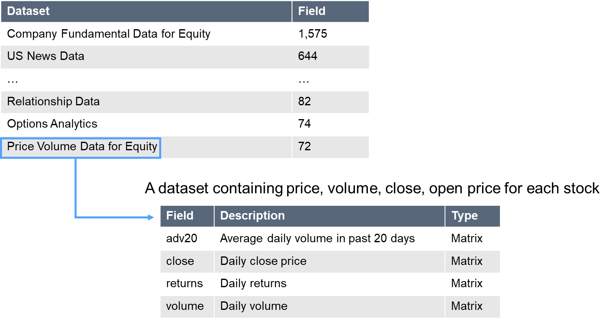
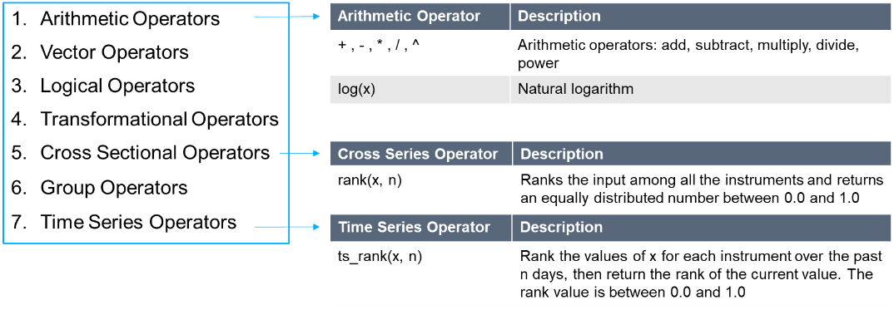
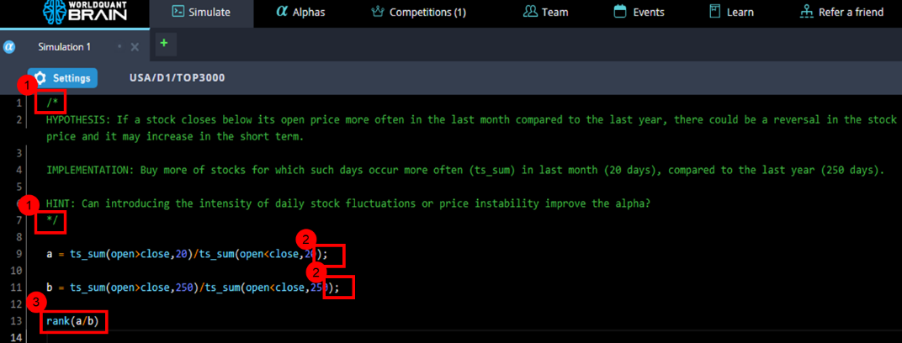

# Introduction to BRAIN Expression Language

> **归档信息**
> - 页面：<https://platform.worldquantbrain.com/learn/documentation/introduction-brain-expression-language>
> - 页面 id：`introduction-brain-expression-language` ｜ 课程：`Getting Started` ｜ 预计时长：PT3M
> - 平台最后更新：2026-08-23T02:12:36.375133-04:00
> - 来源：**平台官方 tutorial-pages 接口原文**（`GET /tutorial-pages/{id}`），文字/表格/图片均为原样转换，未改写
> - 抓取：`src/tools/fetch_learn_docs.py`｜抓取日期 2026-09-15

---

## What is Fast Expression?

“Fast expression” is a proprietary programming language used by WorldQuant BRAIN that is designed to make it easier to write and test financial models. The language can be thought as a form of pseudo code, which uses natural language and simple programming constructs to convey the logic of the algorithm.

The goal of using “Fast expression” on BRAIN is to provide a clear and concise way to express complex ideas and algorithms that can be easily understood by other developers and researchers. By abstracting away the details of the underlying implementation, it can allow BRAIN users to focus on the high-level logic of their algorithms, rather than getting bogged down in the implementation details.

## Characteristics of Fast Expression

Just like how an English sentence consists of a subject, verb and object; Fast expression can include data fields, operators and numerical values.

### Data fields

Data fields refer to a named collection of data, for example 'open price' or 'close price'.

### Operators

Operators refer to a set of mathematical techniques required to implement your Alpha ideas.

## Further Knowledge of Fast Expression

- ***/**** helps to create block comments that span multiple lines of text, while*** */*** denotes the end of the comment. Comments consist of explanatory text to help understand what the code does. [1]
- ***;*** (semicolon) acts as a semicolon in a sentence, separating the end of one sentence from the beginning of another sentence. For the last line of the code (line 13) ; is not needed. [2]
- The last sentence of the entire expression is the Alpha expression that the BRAIN simulator use to calculate the positions to take in each stock. [3]
Lastly, Fast expression does not have classes, objects, pointers, or functions.

In summary, Fast expression provides a clear and concise way for users to express complex ideas and algorithms. Don’t worry if you’re not familiar with Fast expression yet. With a bit of practice, we believe you’ll pick it up in no time!
