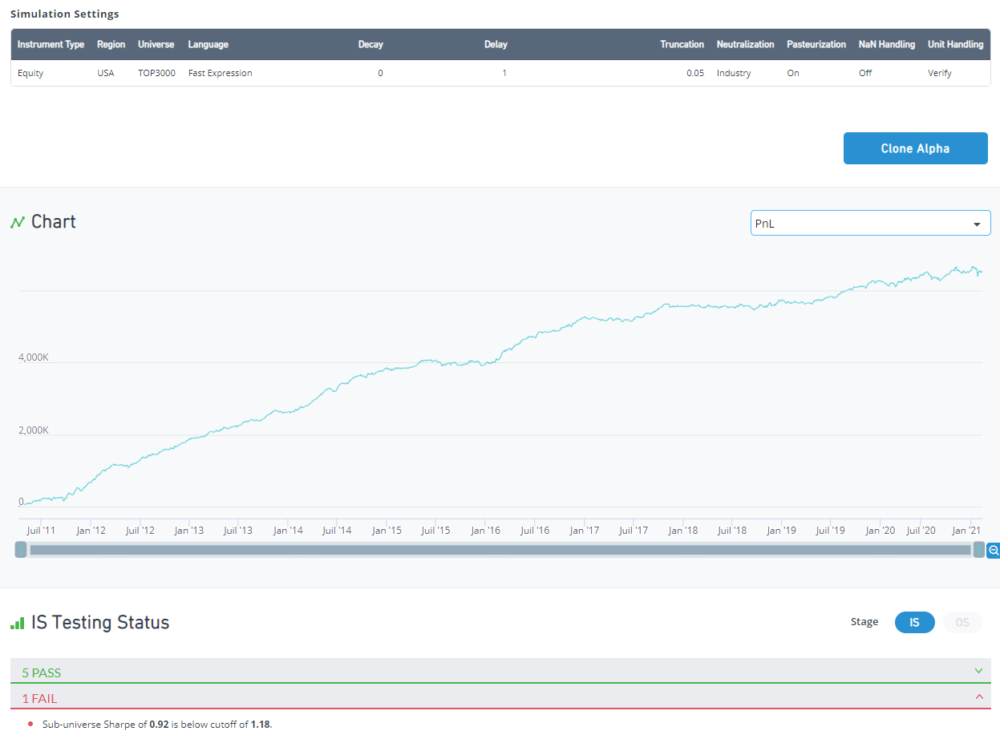
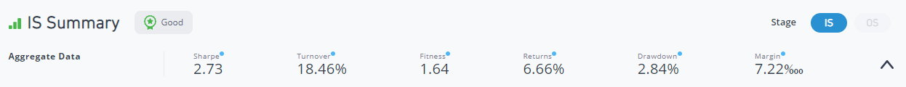
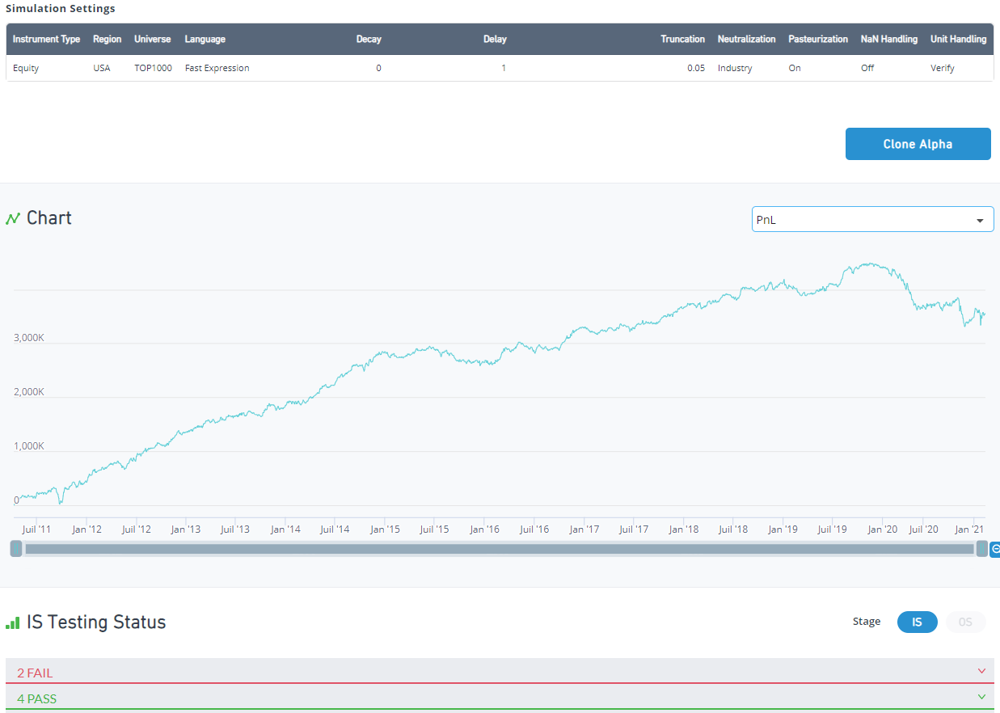
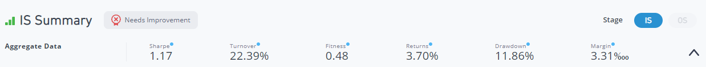

# How to pass the Sub-universe test? 🥈

> **归档信息**
> - 页面：<https://platform.worldquantbrain.com/learn/documentation/how-pass-sub-universe-test>
> - 页面 id：`how-pass-sub-universe-test` ｜ 课程：`Interpreting Results` ｜ 预计时长：-
> - 平台最后更新：2026-08-26T07:10:34.904134-04:00
> - 来源：**平台官方 tutorial-pages 接口原文**（`GET /tutorial-pages/{id}`），文字/表格/图片均为原样转换，未改写
> - 抓取：`src/tools/fetch_learn_docs.py`｜抓取日期 2026-09-15

---

**Sub-universe test** is one of the robustness tests performed on an alpha by the BRAIN platform before submission. In simple words, it ensures that your alpha works not only in the universe you are trying to submit, but that it would also work in the next more liquid (or smaller) universe to some extent.

E. g. if you are trying to submit an alpha on USA TOP3000, the platform will also check its performance on USA TOP1000. If it performs poorly, then it means that your alpha is generating most of the profit on the non-liquid portion of stocks, which is one of the signs that your alpha is not robust enough and most likely will not perform as well as expected in out-of-sample testing. That’s why such alphas are not allowed to be submitted on Brain.

Technical details:

- The threshold to pass the sub-universe test is defined by the formula:
subuniverse_sharpe >= 0.75 * sqrt(subuniverse_size / alpha_universe_size) * alpha_sharpe

- Sub-Universe Sharpe is calculated using PnL of Alpha obtained through the following process (notice that it is similar to the Sharpe of an alpha simulated in the sub-universe, but not exactly the same, as you will see in the example below):

- [Pasteurize](https://platform.worldquantbrain.com/learn/data-and-operators/operators#:~:text=constant.%20Detailed%20description-,pasteurize(x),-Set%20to%20NaN) to the target universe, that is, for all stocks not in the sub-universe, assign value of NaN
- Apply [market neutralization](https://platform.worldquantbrain.com/learn/documentation/create-alphas/simulation-settings#7-neutralization) to resulting set (subtract mean of all values from each value) and then scale Alpha back to original size.
- Calculate PnL using resulting Alpha values

Consider an alpha in USA TOP3000 which fails sub-universe test:

Notice cutoff 0.75 * sqrt(subuniverse_size / alpha_universe_size) * alpha_sharpe = 0.75 * sqrt(1000 / 3000) * 2.73 = 1.18

Let’s check this alpha performance on next more liquid universe, TOP1000

As you see, Sharpe ratio degraded significantly to 1.17, less than the cutoff of 1.18.

Tips to help you improve your alpha(s) and pass the sub-universe test:

- Avoid using multipliers related to the size of the company in your alphas, e.g. rank(-assets), 1 – rank(cap), etc. These multipliers may significantly shift the distribution of your alpha weights to more/less liquid side and it may affect the sub-universe performance
- Try decaying separately the liquid and non-liquid parts of your signal. As a proxy for liquidity you can use cap or volume*close, for example instead of
“ts_decay_linear(signal, 10)”

you can try

“ts_decay_linear(signal, 5) * rank(volume*close) + ts_decay_linear(signal, 10) * (1 – rank(volume*close))”

- Check out your alpha improvements step by step, maybe one of them resulted in better stats, but at the same time alpha started to fail sub-universe test?
- Try these [tips](https://support.worldquantbrain.com/hc/en-us/community/posts/8123350778391-How-do-you-get-a-higher-Sharpe-) to improve overall Sharpe of your alpha
- If nothing helps - don’t get upset. Some signals are just not robust. It is always sad to discard an alpha with good IS performance, but remember: your long-term success as a quant depends on how your alphas will perform in out-of-sample, not during in-sample simulation. Most likely, you just dodged a bad alpha.
