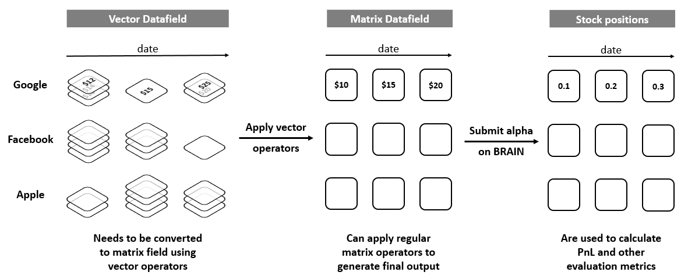
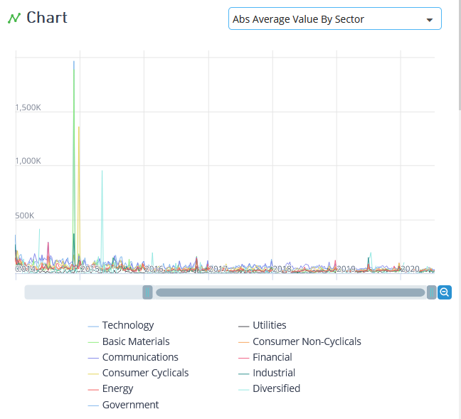
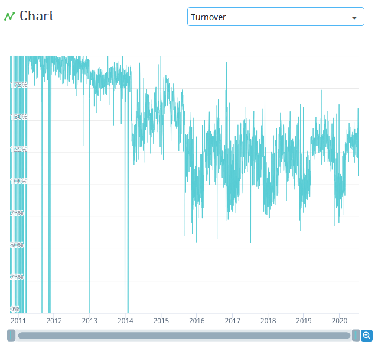
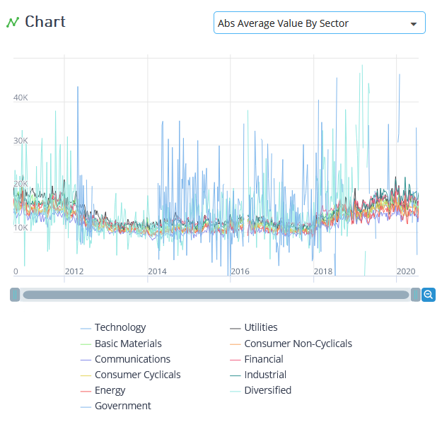
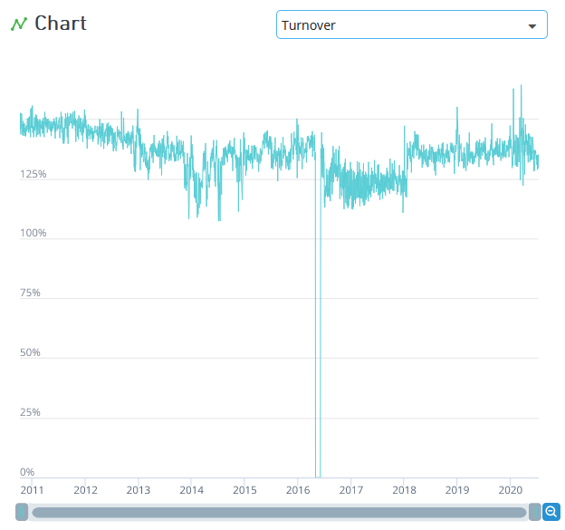

# Vector Data Fields 🥉

> **归档信息**
> - 页面：<https://platform.worldquantbrain.com/learn/documentation/vector-datafields>
> - 页面 id：`vector-datafields` ｜ 课程：`Data` ｜ 预计时长：PT4M
> - 平台最后更新：2026-08-26T03:47:44.438325-04:00
> - 来源：**平台官方 tutorial-pages 接口原文**（`GET /tutorial-pages/{id}`），文字/表格/图片均为原样转换，未改写
> - 抓取：`src/tools/fetch_learn_docs.py`｜抓取日期 2026-09-15

---

Vector Data are a distinct type of data fields that do not have a fixed size. In such type of data fields, the number of events recorded per day per instrument varies, so they are typically stored in a vector. This is unlike regular matrix data that you work with, which has one value per day per instrument. For example: If a dataset covers news data, it could be a vector because for each instrument there can be different number of news/events happening hence, covering such information in a matrix data tends to result in missing useful information. For example, a vector field reporting multiple news events for a single instrument in a day.

Now, whenever you write an Alpha expression, the end result is a matrix of Alpha values which is the position that is taken in the market. And all the operators on platform are made for matrix input, hence use the matrix operator only after using the vec_ operators to convert the vector data field to matrix field. This is done by aggregating vector for each day and instrument into a single value like a matrix has. The same is depicted in figure below:

Following are the different operators to convert vector data field into a matrix each differing in the way vector for a particular date and instrument is aggregated to a single value:

Operator
Description

vec_avg(x)
Taking mean of the vector field x

vec_choose(x,nth=k)
Choosing kth item(indexed at 0) from each vector field x

vec_count(x)
Number of elements in vector field x

vec_ir(x)
Information Ratio (Mean / Standard Deviation) of vector field x

vec_kurtosis(x)
Kurtosis of vector field x

vec_max(x)
Maximum value form vector field x

vec_min(x)
Minimum value form vector field x

vec_norm(x)
Sum of all absolute values of vector field x

vec_percentage(x,percentage=0.5)
Percentile of vector field x

vec_powersum(x,constant=2)
Sum of power of vector field x

vec_range(x)
Difference between maximum and minimum element in vector field x

vec_skewness(x)
Skewness of vector field x

vec_stddev(x)
Standard Deviation of vector field x

vec_sum(x)
Sum of vector field x

 

**Some examples:**

- nws12_afterhsz_1_minute is a field which gives the percentage change in price within first minute of news release. There can be many news items per day for different instruments. Hence, the count of news can be different for different instruments. Suppose we want to apply a reversion/momentum predictor idea i.e. a general observation that when a stock has high intensity, it follows momentum and when a stock has low news intensity, it follows reversion, we require news count data. For this, we need to use vec_count functions on nws12_afterhsz_1_minute (or rather any similar field like nws12_afterhsz_10_min or nws12_afterhsz_120_min) field. This will convert vector of percentage changes to count of such occurrences. You can use vec_count(nws12_afterhsz_120_min) for getting news count. Below are the plots for average value and turnover of vec_count. You can see the raw turnover is very high and sometimes touching 200%. It tends to be necessary to reduce its turnover using decay operators before combining it with base data or other fields to make Alphas.

- ONLY FOR CONSULTANTS WITH ACCESS TO CONSULTANT DATASETS: scl15_d1_sentiment is a field which gives sentiment score of various events in a day. Since we can take only one position for each instrument, as an input as well, we just need one value of sentiment. For AAPL for certain date, if there are 5 sentiment scores and we have to use just one, generally mean of all those scores can be reasonable representative of sentiment in that entire day. So, to convert this sentiment vector to a matrix field, we will use vec_avg(scl15_d1_sentiment). If you think a median could be a better representative, you can use vec_median(scl15_d1_sentiment) instead. Below are again the average value and turnover plots for the vec_avg field. Average value hovers densely  around 15,000 and turnover around 130%. Here as well, you need to reduce turnover by using ts_rank or ts_decay in your Alpha expression.

