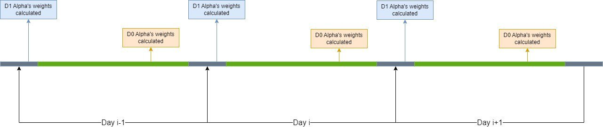
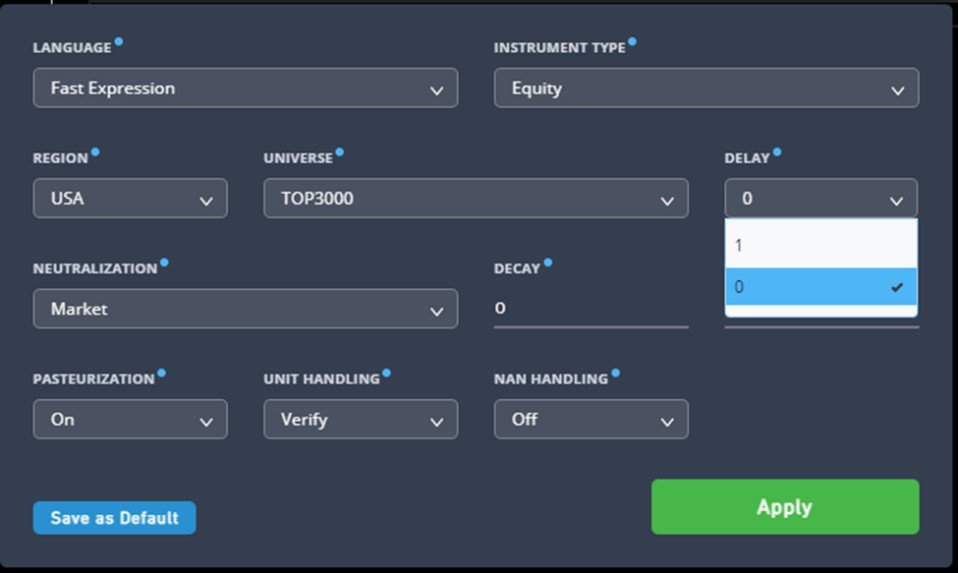

# D0

> **归档信息**
> - 页面：<https://platform.worldquantbrain.com/learn/documentation/getting-started-d0>
> - 页面 id：`getting-started-d0` ｜ 课程：`Advanced Topics` ｜ 预计时长：PT4M
> - 平台最后更新：2026-08-26T01:47:58.735892-04:00
> - 来源：**平台官方 tutorial-pages 接口原文**（`GET /tutorial-pages/{id}`），文字/表格/图片均为原样转换，未改写
> - 抓取：`src/tools/fetch_learn_docs.py`｜抓取日期 2026-09-15

> 📝 该视频在课程库中**有官方字幕**：`alpha-examples-idea-type-and-delay` → `alphas-holding-frequencies-and-delays`（Alphas by Holding Frequencies and Delays，5364 字符），可直接翻译。见 `课程视频总表.md`

---

**Introduction to D0**

Both Delay-0 and Delay-1 Alphas[1] (referred to as D0 and D1 Alphas respectively throughout) try to capitalize by rebalancing the Alpha positions daily. D0 Alphas are Alphas that also try to benefit from using the most recent information. These Alphas utilize the same available data during the day and usually simulate trades some period before the market close.

> 🎬 **内嵌视频**（65s ~ 124s）：<https://www.youtube.com/watch?v=XqdcIayjAug&t=65s>

The below illustration gives you a glimpse of how D1 and D0 Alphas differ. The D1 Alpha's positions are determined by the prior day's data, while D0 Alpha's positions are calculated using the latest data on the same date

The D0 Alpha can typically react faster to spontaneous events in the market, so it can capture stock returns that realize faster in a shorter time horizon, such as earnings surprises, a company's new product announcement(s), or other macroeconomic news.

To go a bit more in-depth, an Alpha’s simulated PnL can decompose into two categories: the simulated trading PnL and the holding PnL. For a daily Alpha on BRAIN (the D1 and D0 Alpha), the PnL typically mainly comes from the holding PnL. The purpose of D0 Alphas is to try to capture more holding PnL with a longer holding period. Besides, there is a phenomenon in the financial market called "Overnight Returns" where the stock price changes in the after-hours session due to companies often releasing news/reports after market close, which is not captured by D1 Alphas.

Moreover, the D0 Alphas enter simulated trades before their D1 Alpha counterparts, so they're expected to have higher performance.

[1] WorldQuant defines “Alphas” as mathematical models that seek to predict the future price movements of various financial instruments.

Because of the nature of D0 Alphas, only a subset of the dataset has D0 data fields. Please check the [dataset](https://platform.worldquantbrain.com/learn/data-and-operators/detailed-operator-descriptions) page or [data explorer](https://platform.worldquantbrain.com/data?delay=0&instrumentType=EQUITY®ion=USA&universe=TOP3000) to get such data. Currently, D0 Alphas are only available for the USA, EUR, and CHN regions.

**Tips and Tricks for Researching D0 Alphas**

Alphas that try to capture some financial event premium can work well in D0, like M&A events, earnings announcements, stock repurchases, etc. Try to utilize the trade_when operator to capture these Alphas.

For the regions with price limits like CHN, if a stock reaches the price limit, the Alpha shouldn't change the position for that particular stock.

Since the submission criteria for D0 Alphas are high, it's not easy to start researching D0 Alpha ideas at first. One way to approach this problem is to re-simulate all your D1 Alphas in D0 settings, try to reimplement the ideas in D0, or try to change the used data fields to equivalent data fields in D0.

Because the D0 Alphas enter trades near the end of the regular trading hours, to ensure that the Alphas' positions can be filled, you should build Alphas on stocks with a higher liquidity profile (i.e., using a liquid universe like TOP1000 or higher for the USA region).

**Alpha Robustness**

Due to D0 Alphas normally having higher turnover than D1 Alphas, to compensate for the increasing transaction costs, higher Sharpe and higher returns are required. But there are also other tests that you have to consider, such as the SubUniverse test and the RobustUniverse test for the CHN region. Good performance in the liquid universe means that the Alpha should have higher capacity.

Also, be sure to self-check your Alpha's performance on D1 (if the data field is also available in D1). A good D0 Alpha should also retain some performance in D1, but there may be a decrease in performance.
