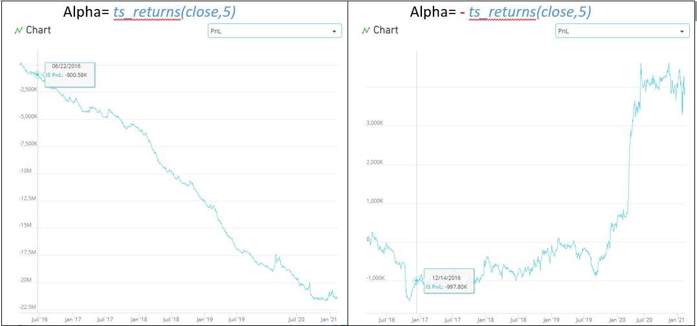
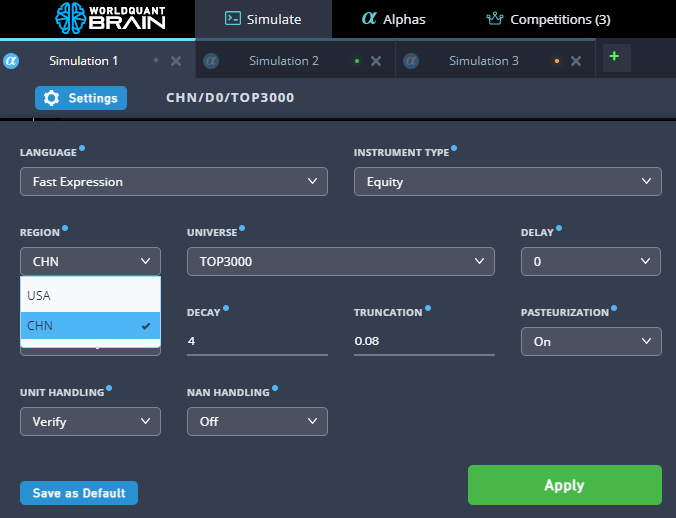
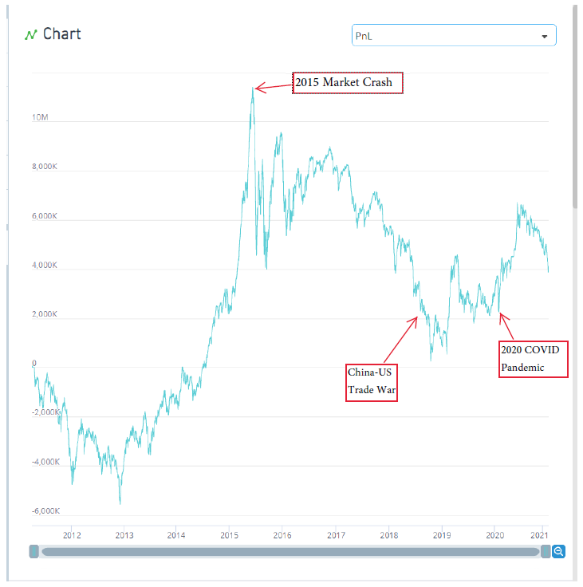

# China Alphas: Understand the market 🥈

> **归档信息**
> - 页面：<https://platform.worldquantbrain.com/learn/documentation/china-region>
> - 页面 id：`china-region` ｜ 课程：`Regions and Universes` ｜ 预计时长：-
> - 平台最后更新：2026-08-26T01:12:37.214921-04:00
> - 来源：**平台官方 tutorial-pages 接口原文**（`GET /tutorial-pages/{id}`），文字/表格/图片均为原样转换，未改写
> - 抓取：`src/tools/fetch_learn_docs.py`｜抓取日期 2026-09-15

---


### REGION SPECIFICS – Things to consider

With BRAIN you can create alphas on China’s Stock market - the second largest in the world by capitalization. There are two primary exchanges:

- Shanghai Stock Exchange (SSE): >2000 listed companies, market cap >7 trillion USD
- Shenzhen Stock Exchange (SZSE): >2000 listed companies, market cap >5 trillion USD


#### Different submission criteria

The China market has a high cost of trading, thus requiring higher returns than other regions.

- D1 criteria: Sharpe >= 1.625 ; Returns >= 6.3% ; Fitness >= 1.0
- D0 criteria: Sharpe >= 2.6 ; Returns >= 8.9% ; Fitness >= 1.3
[**Daily trading limit**](https://www.investopedia.com/terms/d/daily_trading_limit.asp#:~:text=A%20daily%20trading%20limit%20is,occurring%20over%20one%20trading%20day.)**:** price can change in 5-10% range based on stock type. The daily price limit does not apply on the first five trading days after an IPO.[1]

[**Short-selling Restriction:**](https://www.investopedia.com/ask/answers/09/short-selling-china.asp) both short selling and margin buying is allowed only for eligible "blue chip" stocks with good earnings performance and is only permitted for locally licensed investors.

This implies that the opposite alphas will not flip the performance. Check alpha example with same simulation setting below:





### CHN region simulation settings

China [alphas](https://support.worldquantbrain.com/hc/en-us/articles/4902349883927-Click-here-for-a-list-of-terms-and-their-definitions#:~:text=A-,Alpha,-An) are created and simulated on the “Simulate” page. To run your first [simulation](https://support.worldquantbrain.com/hc/en-us/articles/4902349883927-Click-here-for-a-list-of-terms-and-their-definitions#:~:text=definition.-,Simulation,-Simulation) on China region:

- Click on the gear icon under your simulation tab to open the settings panel.
- Select “CHN” in Region drop down menu and click “Apply”





### The replicate of China Stock Index 1000 on BRAIN

The CSI 1000 Index is composed of 1,000 small-scale and well-liquid stocks after excluding the constituent stocks of the CSI 800 Index from all A-shares. It comprehensively reflects the stock price performance of small and medium-sized companies in China's A-share market. You can replicate this index on BRAIN platform:





#### Formula


**示例 Alpha 表达式**

```
rank(cap) < 0.6 ? rank(cap) > 0.1 ? cap : 0 : 0
```

| 设置项 | 值 |
|---|---|
| 标的类型（`instrumentType`） | `EQUITY` |
| 地区（`region`） | `CHN` |
| 股票池（`universe`） | `TOP2000` |
| Delay（`delay`） | `0` |
| Decay（`decay`） | `0` |
| 中性化（`neutralization`） | `NONE` |
| Truncation（`truncation`） | `0.0` |
| Pasteurization（`pasteurization`） | `ON` |
| Unit Handling（`unitHandling`） | `VERIFY` |
| NaN Handling（`nanHandling`） | `OFF` |
| 语言（`language`） | `FASTEXPR` |
| Max Trade（`maxTrade`） | `OFF` |


Since CSI1000 takes 1000 stocks based on the market cap ranking from 800 to 1800, so we have this range from 0.1 to 0.6.

Don’t miss your chance to make unique alphas for the China region and boost performance of your BRAIN alpha portfolio!

[1]: [The impact of price limit system on the comprehensive quality of the stock market: Research on long-term and short-term effects based on submarkets](https://www.tandfonline.com/doi/full/10.1080/23322039.2022.2106635)
